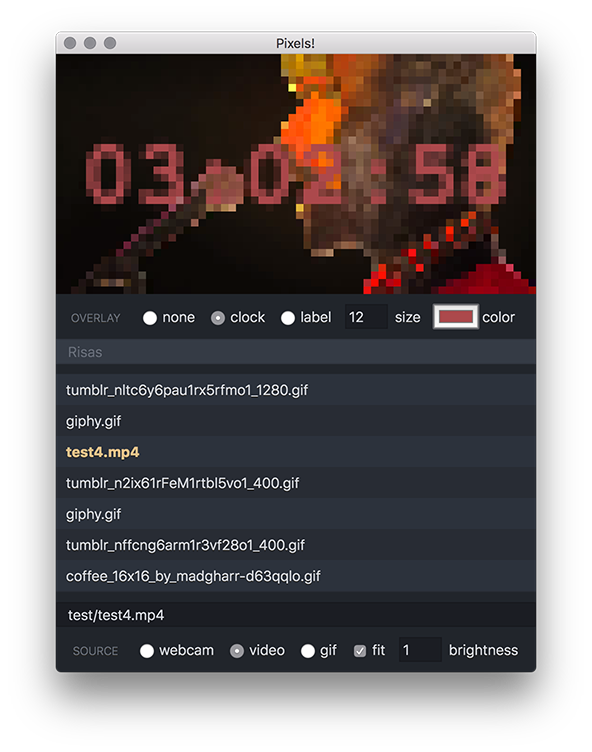

# pixels

> Led panel webcam/video/gif network player for the RPI

## Server:

* [Hook up the LED panel to the RPI](https://github.com/hzeller/rpi-rgb-led-matrix/blob/master/wiring.md)
* Clone this repo and it's submodules: `git clone --recursive https://github.com/danielesteban/pixels.git /usr/src/pixels/`
* Compile the server binary: `cd /usr/src/pixels/server && make`
* Install the unit service file: `ln -s /usr/src/pixels/server/misc/pixels.service /etc/systemd/system/pixels.service`
* Enable the service: `systemctl enable pixels`
* Start the service: `systemctl start pixels`

You may need to edit the RGBMatrix::Options at the bottom of: [server/src/main.cc](server/src/main.cc) to suit your setup and/or edit the paths in [server/misc/pixels.service](server/misc/pixels.service) before enabling the service.

The communication protocol is super straight-forward: Just PNG files headed by a two-byte (uint16) payload length. You may use any client that sends frames in this fashion:

```js
const client = net.connect({
  host: 'RPI_SERVER_HOST',
  port: 8080
}, () => {
  client.write(Buffer.from([png.length & 0xFF, (png.length >> 8) & 0xFF]));
  client.write(png);
});
```

You should also wait for the server to close the connection before opening a new one. This is the way the server let's you know when the vertical sync (buffer swapping) has happened.

```js
client.on('end', sendNextFrame);
```

## Client:



* Install app dependencies: `cd client && npm i`
* Launch the desktop client: `cd client && npm start`

You'll probably need to edit the host/port of your RPI server at the top of: [client/renderer.js](client/renderer.js)
